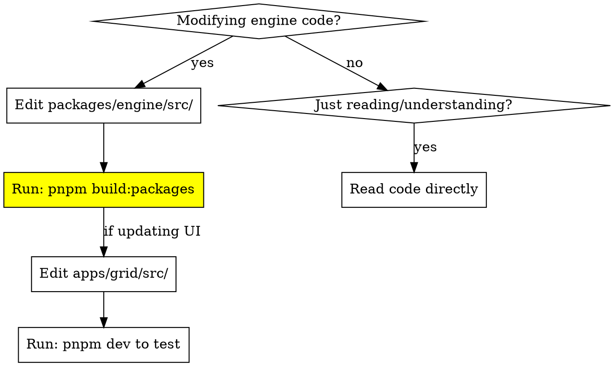

# Blibliki Engine

## Overview

The Blibliki engine (`packages/engine`) is a TypeScript audio synthesis framework built on Web Audio API. **Critical**: Apps consume BUILT packages from `dist/`, not source files. Changes require rebuilding before they appear in apps.

## Monorepo Build Workflow

**The #1 mistake**: Modifying engine source and expecting apps to pick it up without rebuilding.



**Why this matters:**
- Apps import from `packages/engine/dist/` (built artifacts), not `src/`
- `pnpm test` validates source but doesn't build
- Without rebuild, apps use stale code

**Commands:**
- `pnpm dev` - Start dev servers with watch mode (RECOMMENDED - auto-rebuilds on save)
- `pnpm build:packages` - Rebuild all packages (use when working without `pnpm dev`)
- `pnpm test` - Run tests (validates source, doesn't build)
- `pnpm tsc` - Type checking

**When to rebuild:**
- **Using `pnpm dev`**: No manual rebuild needed - changes auto-rebuild on save. Check terminal for build errors.
- **Not using `pnpm dev`**: Must run `pnpm build:packages` manually after engine changes before testing in apps.

## Module Implementation Patterns

### Constructor Signature

**CRITICAL:** Module constructor signature is fixed.

```typescript
// ✅ CORRECT - Mono module
class MonoGain extends Module<ModuleType.Gain> {
  constructor(engineId: string, params: ICreateModule<ModuleType.Gain>) {
    const props = { ...DEFAULT_PROPS, ...params.props };
    const audioNodeConstructor = (context: Context) =>
      new GainNode(context.audioContext);

    super(engineId, { ...params, audioNodeConstructor, props });
    this.registerDefaultIOs();
  }
}

// ❌ WRONG - Different signature
constructor(engine: Engine, id: string, props?: any)
```

### Registering IOs

Use `register*` helper methods, NOT direct AudioIO construction.

```typescript
// ✅ CORRECT - AudioParam modulation input
this.registerAudioInput({
  name: "gain",
  getAudioNode: () => this.audioNode.gain,  // Returns AudioParam
});

// ✅ CORRECT - MIDI input
this.registerMidiInput({
  name: "midi in",
  onMidiEvent: this.onMidiEvent,
});

// ❌ WRONG - Don't construct AudioIO directly
this.inputs = {
  gain: new AudioIO(this, 'gain', 'input', this.audioNode.gain)
};
```

**Quick reference:**
- `registerAudioInput(props)` - Audio/AudioParam inputs
- `registerAudioOutput(props)` - Audio outputs
- `registerMidiInput(props)` - MIDI inputs with event handler
- `registerMidiOutput(props)` - MIDI outputs
- `registerDefaultIOs()` - Auto-registers standard "in"/"out" + "midi in"

### Module Props Schema

**CRITICAL:** Schema is a TypeScript type, not a function. Use `kind` not `type`.

```typescript
// ✅ CORRECT
export type IGainProps = { gain: number };

export const gainPropSchema: ModulePropSchema<IGainProps> = {
  gain: {
    kind: "number",  // kind, not type
    min: 0,
    max: 2,
    step: 0.01,
    label: "Gain",
  },
};

// ❌ WRONG
modulePropSchema({ gain: { type: 'number', ... }})
```

### Applying Props with Setter Hooks

Props don't automatically update Web Audio nodes. Use setter hooks.

```typescript
class MonoGain extends Module<ModuleType.Gain>
  implements Pick<SetterHooks<IGainProps>, "onAfterSetGain">
{
  // ✅ CORRECT - Hook called when props.gain changes
  onAfterSetGain: SetterHooks<IGainProps>["onAfterSetGain"] = (value) => {
    this.audioNode.gain.value = value;
  };
}

// Available hooks per prop:
// - onSetPropName(value) - Transform before setting (return new value)
// - onAfterSetPropName(value) - Side effect after setting (void)
```

### PolyModule Pattern

**CRITICAL:** PolyModule takes `monoModuleConstructor`, not pre-allocated voices.

```typescript
// ✅ CORRECT - Poly module
export default class Gain extends PolyModule<ModuleType.Gain> {
  constructor(engineId: string, params: IPolyModuleConstructor<ModuleType.Gain>) {
    const props = { ...DEFAULT_PROPS, ...params.props };

    // Pass constructor function for mono voices
    const monoModuleConstructor = (
      engineId: string,
      params: IModuleConstructor<ModuleType.Gain>
    ) => new MonoGain(engineId, params);

    super(engineId, { ...params, props, monoModuleConstructor });
    this.registerDefaultIOs();
  }
}

// ❌ WRONG - Don't pre-allocate voice instances
this.voices = Array.from({ length: 8 }, () => new Voice());
```

## Module Registration Checklist

When creating a new module, update FIVE locations:

1. Create module class: `packages/engine/src/modules/YourModule.ts`
2. Export schema: `packages/engine/src/modules/index.ts`
3. Add to ModuleType enum: `packages/engine/src/types.ts`
4. Create UI component: `apps/grid/src/components/AudioModule/YourModule.tsx`
5. Register in UI mapping: `apps/grid/src/components/AudioModule/index.tsx`

**After registration:** Run `pnpm build:packages` before testing in grid app.

## Common Workflows

### Debugging "Changes Don't Appear"

If engine changes don't appear in grid app:
1. Did you run `pnpm build:packages`? ← Most common cause
2. Check `packages/engine/dist/` has updated files
3. Check browser console for import errors
4. Restart dev server if needed
5. If using `pnpm dev`, it auto-rebuilds (check for build errors in terminal)

### Debugging MIDI Routing

MIDI flow: `MidiDevice` → `MidiSelector` → `VirtualMidi` → `Module.onMidiEvent`

**Files to check:**
- `packages/engine/src/modules/MidiSelector.ts` - Routes MIDI from devices
- `packages/engine/src/modules/VirtualMidi.ts` - Programmatic MIDI generation
- `apps/grid/src/lib/MidiDevice*.ts` - Device management
- Your module's `onMidiEvent` handler and registered MidiIO inputs

**Common issues:**
- MidiSelector not routing to correct module
- PolyModule voices not created before IOs registered (constructor timing)
- MIDI input not registered via `registerMidiInput()`

### Converting to Polyphonic

1. Read `packages/engine/src/core/module/PolyModule.ts` first
2. Create mono version of module (handles one voice)
3. Change base class from `Module<T>` to `PolyModule<T>`
4. Pass `monoModuleConstructor: () => new MonoYourModule(...)` to super
5. Voices created automatically by PolyModule base class
6. Build and test with multiple simultaneous notes

## Before Finishing

When completing engine work, verify ALL of these:

- [ ] Engine source changes complete
- [ ] Module schema updated if needed
- [ ] Verified packages rebuilt (check terminal if using `pnpm dev`, or run `pnpm build:packages`)
- [ ] UI components updated if needed
- [ ] Ran `pnpm test` (all tests pass)
- [ ] Ran `pnpm tsc` (type checking passes)
- [ ] Ran `pnpm lint` (no linting errors)
- [ ] Tested integration in grid app (with `pnpm dev` running)
- [ ] Verified feature works end-to-end in browser

**Most commonly missed:** Verifying packages are rebuilt before testing in app.

## Common Mistakes

| Mistake | Fix |
|---------|-----|
| "Changes don't appear in app" | Run `pnpm build:packages` to rebuild engine |
| "Tests pass but app breaks" | Tests validate source, apps use dist/. Rebuild packages. |
| Wrong constructor signature | Use `(engineId: string, params: ICreateModule<T>)` |
| `new AudioIO()` directly | Use `registerAudioInput/Output()` helpers |
| Schema uses `type` property | Use `kind` property instead |
| `modulePropSchema()` function call | Plain object with type `ModulePropSchema<T>` |
| Props not updating Web Audio | Implement setter hooks: `onAfterSetPropName` |
| Pre-allocating voices in PolyModule | Pass `monoModuleConstructor` function |
| "Import errors in app" | Check module exported in index.ts and schema registered |
| "PolyModule voices not created" | Ensure voices created before IOs registered (constructor timing) |

## File Locations

When implementing features, reference these files:
- Example modules: `packages/engine/src/modules/Gain.ts`, `Oscillator.ts`
- Module base: `packages/engine/src/core/module/Module.ts`
- PolyModule base: `packages/engine/src/core/module/PolyModule.ts`
- IO system: `packages/engine/src/core/IO/AudioIO.ts`, `MidiIO.ts`
- Schema types: `packages/engine/src/core/schema.ts`
