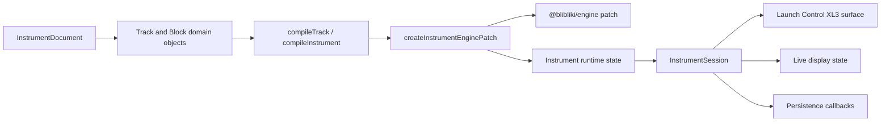

# @blibliki/instrument

`@blibliki/instrument` is the performance-instrument layer for Blibliki. It turns a product-level instrument document into:

- an `@blibliki/engine` patch with modules and routes,
- runtime navigation state for tracks, pages, and controller modes,
- display state for the hardware screen,
- MIDI controller behavior for Launch Control XL3,
- persistence-ready document snapshots.

Think of this package as the bridge between "what the musician owns" and "what the audio engine runs".

## The Mental Model

The package reads left to right:

```text
InstrumentDocument
  -> Instrument/Track/Block/Page/Slot domain model
  -> compiled instrument and compiled track data
  -> Engine patch serialization
  -> Instrument runtime object and navigation state
  -> InstrumentSession live engine updates
  -> MIDI hardware, display, persistence, and UI callbacks
```

Earlier stages are pure data and domain modeling. Later stages are allowed to talk to live systems. Do not make an earlier stage reach forward into MIDI devices, engine instances, persistence callbacks, or UI updates.



## Building Blocks

### InstrumentDocument

`src/document/types.ts` defines the stored product shape. It is intentionally plain data: instrument metadata, global controls, tracks, source profile, FX chain, note source, MIDI channel, controller slot values, and sequencer pages.

Use this layer when you are answering: "What should be saved, loaded, or shared?"

Important files:

- `src/document/types.ts`: public document contract.
- `src/document/defaultDocument.ts`: default saved shape.
- `src/document/InstrumentDocument.ts`: document model helper.
- `src/document/SavedInstrumentDocument.ts`: converts runtime state back into a saved document.
- `src/templates/defaultTemplate.ts`: product templates.
- `src/profiles/hardwareProfile.ts`: supported hardware profile metadata.

The document layer should not know about live engine modules, MIDI devices, or display rendering.

### Blocks

Blocks are reusable musical components inside a track. A block owns its engine modules, local routes, inputs, outputs, and controller slots. `BaseBlock` owns the common invariants and serialization. Concrete blocks describe one musical concept.

Important files:

- `src/blocks/BaseBlock.ts`: base class for block identity, modules, IO, routes, slots, and serialization.
- `src/blocks/AmpBlock.ts`, `FilterBlock.ts`, `LfoBlock.ts`, `TrackGainBlock.ts`: core track blocks.
- `src/blocks/source/*Block.ts`: source profiles such as oscillator, wavetable, noise, three-oscillator, drum machine.
- `src/blocks/effects/*Block.ts`: effect profiles such as distortion, chorus, delay, reverb.
- `src/blocks/helpers.ts`: small typed helpers for module IDs and module-prop slots.

Use a block class when the concept owns modules, routes, IO, or slots. Use a helper only for small deterministic naming or slot creation logic.

### Tracks

A track is a complete voice lane. It assembles a source, amp, filter, LFO, four FX blocks, track gain, MIDI input, audio output, audio routes, and controller pages.

Important files:

- `src/tracks/BaseTrack.ts`: base class for track identity, blocks, IO, routes, runtime MIDI, pages, and serialization.
- `src/tracks/Track.ts`: default concrete track layout.
- `src/tracks/TrackSourceProfile.ts`: source block and source-page selection.
- `src/tracks/TrackEffectProfile.ts`: FX block and FX-page selection.
- `src/tracks/TrackMidiRuntime.ts`: note-input runtime modules and routes for external MIDI or step sequencer tracks.
- `src/tracks/createTrackFromDocument.ts`: turns a saved track document into a `Track` instance.

The default `Track` is product opinion, not compiler logic. It says what a Blibliki track contains. The compiler later turns that into engine-ready modules and routes.

### Pages and Slots

Pages describe what the controller exposes to the performer. Slots bind controller positions to module properties.

Important files:

- `src/pages/Page.ts`: page, region, slot reference, and empty slot primitives.
- `src/slots/BaseSlot.ts`: slot binding and initial-value types.
- `src/tracks/TrackPageSlots.ts`: track-local slot reference helpers.
- `src/compiler/trackPageCompilation.ts`: resolves page slot references into compiled display/controller slot data.

Slots should stay deterministic. A saved controller value should point to the same block, slot, module, and prop after recompilation unless the product model intentionally changes.

## Compiler Pipeline

The compiler layer is pure data-in/data-out. It should not mutate documents, subscribe to devices, update engine modules, or send MIDI events.

### Track Compilation

`compileTrack(track)` returns a `CompiledTrack`:

- `engine.modules`: engine modules from each block,
- `engine.routes`: block-internal routes plus expanded track routes,
- `pages`: resolved page slots,
- `launchControlXL3`: controller-page summaries, resolved page slots with CC metadata, and MidiMapper track mappings.

Important files:

- `src/compiler/compileTrack.ts`: orchestration entry point.
- `src/compiler/trackEngineCompilation.ts`: modules and routes.
- `src/compiler/trackPageCompilation.ts`: page and slot resolution.
- `src/compiler/launchControlXL3TrackCompilation.ts`: controller CC metadata and MidiMapper mappings.
- `src/compiler/scoping.ts`: scopes track-local IDs into instrument-level IDs.

### Instrument Compilation

`compileInstrument(document)` compiles enabled tracks and instrument metadata. It does not create live runtime modules by itself.

Important files:

- `src/compiler/compileInstrument.ts`: compiles enabled document tracks.
- `src/compiler/instrumentTypes.ts`: compiled instrument and runtime contracts.
- `src/compiler/types.ts`: compiled track, page, and engine patch contracts.

### Engine Patch Creation

`createInstrumentEnginePatch(document, options)` is the main bridge into `@blibliki/engine`. It combines compiled track modules with instrument runtime modules, runtime routes, MIDI selections, global mappings, navigation state, and step-sequencer IDs.

Important files:

- `src/compiler/createInstrumentEnginePatch.ts`: main engine-patch assembly.
- `src/compiler/instrumentRuntimeState.ts`: normalized runtime state and deterministic runtime IDs.
- `src/compiler/instrumentRuntimeModules.ts`: instrument-level runtime modules.
- `src/compiler/instrumentRuntimeRoutes.ts`: instrument-level runtime routes.
- `src/compiler/createInstrumentRuntimeModules.ts`: runtime module creation helpers.
- `src/compiler/createInstrumentMidiMapperProps.ts`: MidiMapper track and global mappings.
- `src/compiler/engineSerialization.ts`: converts internal module data to engine serialization.
- `src/core/runtimeIds.ts`, `src/core/runtimeRoutes.ts`: deterministic runtime naming.

The output is a `CompiledInstrumentEnginePatch`: it contains both the compiled instrument metadata and the serialized `@blibliki/engine` patch.

## Runtime Objects

### Instrument

`src/Instrument.ts` is the domain runtime object. It wraps a compiled engine patch and owns navigation-derived runtime state.

It answers:

- Which track is active?
- Which controller page is active?
- What page is visible?
- What display state follows from the current runtime state?
- How should navigation update the runtime patch and MidiMapper focus?

Use this class for domain runtime behavior that does not require live engine/device access.

### InstrumentNavigation

`src/core/InstrumentNavigation.ts` owns active track/page/mode invariants. It keeps navigation behavior testable without a hardware device.

Use it when changing track wrapping, page wrapping, performance mode, sequencer edit mode, shift state, selected sequencer page, or selected step.

### InstrumentRuntime

`src/InstrumentRuntime.ts` exposes compatibility helpers around `Instrument`:

- `createInstrumentRuntimeState`
- `createInstrumentDisplayState` (exported from the package root as `createRuntimeDisplayState`)
- `navigateInstrumentRuntime`
- `updateInstrumentRuntimeNavigation`

Prefer the `Instrument` class internally. Keep these helpers as public API conveniences.

## Live Session Boundary

`src/InstrumentSession.ts` is the live boundary. It is allowed to talk to:

- engine module updates,
- engine prop observers,
- transport state callbacks,
- MIDI input devices,
- MIDI output LEDs,
- persistence callbacks,
- display state callbacks.

The session owns coordination, not product modeling. It receives controller events, asks the hardware surface to reduce them into commands, applies necessary engine updates, syncs LEDs, emits runtime patch changes, and emits display state changes.

Supporting files:

- `src/InstrumentSessionMidi.ts`: selected MIDI device lookup and MidiMapper update construction.
- `src/InstrumentSessionPersistence.ts`: two-step save/discard confirmation flow and notices.
- `src/display/LiveInstrumentDisplayState.ts`: reads live engine module props into display state.

If a behavior can be tested without a live engine or device, keep it outside `InstrumentSession`.

## Hardware Surface

The package currently targets Launch Control XL3 as the controller surface.

Important files:

- `src/surfaces/launchControlXL3/LaunchControlXL3Surface.ts`: reduces raw MIDI events to domain commands.
- `src/surfaces/launchControlXL3/LaunchControlXL3SequencerEdit.ts`: sequencer edit facade for display, page sync, encoder edits, and LED sync.
- `src/surfaces/launchControlXL3/LaunchControlXL3SequencerPatch.ts`: applies sequencer edit changes to runtime patch and engine updates.
- `src/surfaces/launchControlXL3/LaunchControlXL3SequencerLeds.ts`: step-button LED sync.
- `src/surfaces/launchControlXL3/LaunchControlXL3NavigationLeds.ts`: navigation LED sync.
- `src/surfaces/launchControlXL3/LaunchControlXL3SequencerDisplay.ts`: sequencer edit display state.
- `src/hardware/launchControlXL3/pageMap.ts`: maps controller pages to instrument page keys.
- `src/hardware/launchControlXL3/globalRow.ts`: global row control definitions.

Hardware-specific CC numbers should live in hardware/surface files. They should not leak into generic instrument compiler or session code unless the file is explicitly a hardware bridge.

## Display Output

Display state is the package's UI-facing output. It is independent from any concrete display renderer.

Important files:

- `src/display/InstrumentDisplayState.ts`: pure display state from runtime state and compiled page data.
- `src/display/LiveInstrumentDisplayState.ts`: same display shape, but values come from live engine module props.

The display layer should return plain data. Rendering to terminal, LCD, OSC, or React belongs in consuming packages.

## Public Entry Points

Most consumers should start with one of these:

```ts
import {
  createDefaultInstrumentDocument,
  createInstrumentEnginePatch,
  createInstrumentControllerSession,
  createLiveInstrumentDisplayState,
} from "@blibliki/instrument";
```

Typical boot flow:

```ts
const document = createDefaultInstrumentDocument();
const runtimePatch = createInstrumentEnginePatch(document);

engine.load(runtimePatch.patch);

const session = createInstrumentControllerSession(engine, runtimePatch, {
  onRuntimePatchChange(nextPatch) {
    // Persist draft state or update app state.
  },
  onDisplayStateChange(displayState) {
    // Send to UI, LCD, OSC, or another display target.
  },
  onPersistenceAction(action, nextPatch) {
    // Save or discard draft.
  },
});
```

## How To Change The Package

### Add a Source Profile

1. Add or update a source block in `src/blocks/source/`.
2. Add the source profile ID to `src/document/types.ts`.
3. Register source construction and page slots in `src/tracks/TrackSourceProfile.ts`.
4. Add tests in the existing block and track/compiler test files.

### Add an Effect Profile

1. Add or update an effect block in `src/blocks/effects/`.
2. Add the effect profile ID to `src/document/types.ts`.
3. Register block construction and page slots in `src/tracks/TrackEffectProfile.ts`.
4. Add tests through `Track` or `compileTrack` behavior.

### Change Track Audio Flow

1. Update `src/tracks/Track.ts` if the product flow changes.
2. Keep route expansion behavior in `src/compiler/trackEngineCompilation.ts`.
3. Add or update `test/tracks/TrackIO.test.ts` and `test/compiler/compileTrack.test.ts`.

### Add Runtime Modules Or Routes

1. Put deterministic IDs in `src/core/runtimeIds.ts`.
2. Put deterministic route helpers in `src/core/runtimeRoutes.ts`.
3. Add module creation in `src/compiler/instrumentRuntimeModules.ts` or `src/compiler/createInstrumentRuntimeModules.ts`.
4. Add route creation in `src/compiler/instrumentRuntimeRoutes.ts`.
5. Verify through `test/compiler/createInstrumentEnginePatch.test.ts`.

### Change Controller Behavior

1. Reduce raw MIDI events in `LaunchControlXL3Surface`.
2. Keep domain navigation in `InstrumentNavigation`.
3. Put live engine updates in `InstrumentSession` only when they need an engine.
4. Put sequencer edit patch changes in `LaunchControlXL3SequencerPatch`.
5. Test surface reduction and session behavior separately.

### Change Display Behavior

1. Change display shape in `InstrumentDisplayState` only if consumers need a new contract.
2. Change live value resolution in `LiveInstrumentDisplayState`.
3. Keep concrete rendering outside this package.

## Rules Of The Road

- Prefer classes for concepts with identity, lifecycle, collections, navigation, active selections, synchronization, or invariants.
- Prefer pure functions for compilers, serialization, deterministic naming, and tiny focused helpers.
- Keep compiler code pure.
- Keep live engine/device calls inside sessions or hardware adapters.
- Keep IDs and routes deterministic.
- Do not add vague `helpers.ts`, `utils.ts`, `runtime.ts`, or `controller.ts` dumping grounds.
- Add tests to the existing concept test file. Do not create test files named after bugs or refactor phases.
- Keep `src/index.ts` as the public contract. Do not export internal helpers only to make tests easier.

## Verification

From the repository root:

```bash
pnpm tsc
pnpm lint
pnpm test
pnpm format
```

For faster package-only checks while developing:

```bash
pnpm -C packages/instrument tsc
pnpm -C packages/instrument lint
pnpm -C packages/instrument test
pnpm -C packages/instrument format
```

Use the package-level checks while iterating. Run the root checks before committing because `@blibliki/instrument` is consumed by other workspaces such as `packages/pi` and `apps/grid`.
